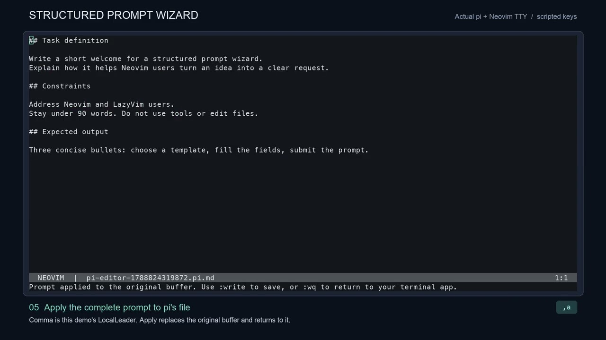

# structured-prompt.nvim

A structured prompt wizard for Neovim: pick a template in a tree-style sidebar,
write each answer in a real Vim buffer, and return the assembled prompt to your
original text buffer. You can also copy it or export a new Markdown buffer.

Requires **Neovim 0.10+**. No plugin dependencies or Nerd Font required. Works with
LazyVim, standalone lazy.nvim, and Neovim's built-in package loader.

[Install](#install) · [Workflow](#workflow) · [Pi integration](#use-with-pis-external-editor) ·
[Key bindings](#keys) · [JSON configuration](#use-a-personal-json-catalog)

## Video walkthrough

[](https://www.youtube.com/watch?v=JVMYZFYO_FA)

**[Watch the 1:24 pi → Neovim → pi walkthrough directly on YouTube](https://www.youtube.com/watch?v=JVMYZFYO_FA)**

GitHub sanitizes YouTube iframe embeds in README files, so the preview above is a
clickable thumbnail that opens the published video. It shows a real pi terminal
session: press `Ctrl+G`, choose a template, fill its fields, apply the assembled
prompt to the original Neovim buffer, then `:wq` and submit with `Enter`.
See the [demo notes, chapters, and screenshots](artifacts/pi-demo/README.md).

The **[JSON configuration walkthrough](https://youtu.be/2tpgUYRdvzc)** shows all
twelve templates, a CO-STAR brief, and adding templates and fields through JSON.

## Try it here

From this project directory:

```sh
make demo
```

This launches an isolated configuration, without changing your Neovim setup.
It sets the local leader to `,`, so `,p` toggles preview, `,y` copies, and `,e`
exports. Use `:qa!` to exit the demo.

## Install

### lazy.nvim and LazyVim

Save this spec as `~/.config/nvim/lua/plugins/structured-prompt.lua`. It works with
both [lazy.nvim](https://lazy.folke.io/) and [LazyVim](https://www.lazyvim.org/):

```lua
return {
  "jkieley/neovim-structured-prompt-wizard",
  name = "structured-prompt.nvim",
  main = "structured_prompt",
  cmd = {
    "StructuredPrompt",
    "StructuredPromptBuffer",
    "StructuredPromptApply",
    "StructuredPromptToggle",
    "StructuredPromptReload",
  },
  keys = {
    { "<leader>ap", "<cmd>StructuredPrompt<cr>", desc = "Structured prompt" },
    { "<leader>aB", "<cmd>StructuredPromptBuffer<cr>", desc = "Build prompt for buffer" },
    { "<leader>aP", "<cmd>StructuredPromptReload<cr>", desc = "Reload prompt templates" },
  },
  opts = {},
}
```

**LazyVim:** files under `lua/plugins/` are imported automatically. Save the spec,
restart Neovim, and run `:Lazy sync`.

**Standalone lazy.nvim:** make sure your existing `require("lazy").setup(...)`
imports the `plugins` directory. For example, after lazy.nvim's bootstrap:

```lua
require("lazy").setup({
  spec = {
    { import = "plugins" },
    -- Keep your other plugin specs and imports here.
  },
})
```

Add that import to your existing setup rather than adding a second setup call.
If you keep all plugins in one file, insert the table from the first example
directly into your existing plugin list instead. If you haven't installed
lazy.nvim yet, follow its [bootstrap instructions](https://lazy.folke.io/installation)
first. See also [organizing plugin specs](https://lazy.folke.io/usage/structuring).
Restart Neovim and run `:Lazy sync`.

Open any ordinary text buffer, then run **`:StructuredPromptBuffer`** or press
**`<leader>aB`** to build a prompt for it. Use **`:StructuredPrompt`** or
**`<leader>ap`** when you only want to copy or export a prompt. With
[LazyVim's default leader](https://www.lazyvim.org/configuration/general),
`<leader>aB` means `Space`, `a`, then uppercase `B`.

The explicit `main` lets lazy.nvim call `require("structured_prompt").setup(opts)`.
The spec follows [LazyVim's normal plugin configuration](https://www.lazyvim.org/configuration/plugins)
and [lazy.nvim's plugin spec](https://lazy.folke.io/spec).
All wizard mappings are buffer-local and have descriptions for which-key.
The plugin uses your existing colorscheme, statusline, notifications, and window
navigation. It neither installs nor reconfigures LazyVim plugins.

To use the demo's `,` prefix, set `maplocalleader` before the plugin loads. In
LazyVim, put this in `~/.config/nvim/lua/config/options.lua`; with standalone
lazy.nvim, put it in `init.lua` before `require("lazy").setup(...)`:

```lua
vim.g.maplocalleader = ","
```

Otherwise use your existing `<LocalLeader>` in place of `,` in the examples.
Neovim's default is `\`.

For local development, replace the repository string in the spec with
`dir = vim.fn.expand("~/git/neovim-structured-prompt-wizard")` and keep the other
fields. Adjust the path to your checkout.

### Standard Neovim

Clone the public repository into Neovim's built-in package directory:

```sh
git clone https://github.com/jkieley/neovim-structured-prompt-wizard.git \
  ~/.local/share/nvim/site/pack/plugins/start/structured-prompt.nvim
```

Then optionally configure it in `init.lua`:

```lua
vim.g.maplocalleader = ","
require("structured_prompt").setup({})
vim.keymap.set("n", "<leader>ap", "<cmd>StructuredPrompt<cr>", {
  desc = "Structured prompt",
})
vim.keymap.set("n", "<leader>aB", "<cmd>StructuredPromptBuffer<cr>", {
  desc = "Build prompt for buffer",
})
```

The clone path assumes the standard Unix/macOS data directory; with a custom
`XDG_DATA_HOME`, use `:echo stdpath('data')` followed by
`/site/pack/plugins/start/structured-prompt.nvim` instead.
`setup()` is optional when using defaults. No global key bindings are installed
by the plugin itself.

## Workflow

The wizard starts with a vertical list of templates. Selecting one hides that
list and reveals its input fields. Each answer has its own multiline Vim buffer;
the wizard assembles those answers into one prompt in field order. Choose the
command that matches where you want the result:

| Start with | Finish with | Result |
| --- | --- | --- |
| `:StructuredPrompt` | `<LocalLeader>y` | Copy the assembled prompt |
| `:StructuredPrompt` | `<LocalLeader>e` | Open the prompt in a new Markdown buffer |
| `:StructuredPromptBuffer` | `<LocalLeader>a` | Replace the original text buffer with the prompt |

1. Run `:StructuredPrompt`. A dedicated tab opens with the cursor on the first template.
2. Move with `j` / `k` and press `<Enter>` to select a template. The template list
   disappears and the sidebar shows only that template's fields. Use
   `<LocalLeader>t` to return to the template picker.
3. Press `i` to write the first answer. Each field is a separate multiline scratch
   buffer with normal editing, registers, visual mode, and undo. Hints are virtual
   placeholders on empty fields; they are never included in your prompt.
4. Jump between fields with `]f` / `[f`, or use the insert-mode shortcuts below.
   You can also select any field from the sidebar with `<Enter>`.
5. Toggle the live preview, copy the prompt, or export it to a regular Markdown
   buffer. Use `:write path.md` to save an export.

`[x]` means a field contains text; `*` means it is required. Copy and export report
missing required fields; applying to a buffer does the same. The preview remains
available for incomplete drafts.
Empty optional fields are omitted from the default Markdown output.

Switching templates preserves each template's draft. Closing and reopening the
wizard preserves drafts **in memory for the current Neovim session**. Nothing is
sent to an AI service or saved automatically. Undo history and field cursors are
retained while the wizard is open; drafts do not survive quitting Neovim.

### Build a prompt for the current text buffer

These key examples assume `,` is your local leader, as configured above.

1. Open the text buffer that should receive the prompt. It may be an unnamed
   buffer, an existing file, or the temporary file opened by another app.
2. Run `:StructuredPromptBuffer` (or `:StructuredPromptBuffer co_star`).
   The wizard opens in its own tab and remembers this original buffer.
3. Choose a template and fill its fields. The sidebar shows fields after selection;
   `,s` focuses them and `,t` returns to the template picker.
4. Press `<Esc>`, then `,a`, or run `:StructuredPromptApply`.
   The complete prompt **replaces all text in the original buffer**, closes the
   wizard, and returns you to that buffer. This is a normal undoable buffer edit.
5. Review the result. Use `:write` to save it, or `:wq` to save and quit.

The wizard leaves the original buffer alone until you apply. It does not import
existing prose into fields, save the file, quit Neovim, or submit to another app.
If the original buffer changes while the wizard is open, applying is refused so
both edits survive; use `,e` to export to a separate buffer. Read-only, unloaded,
and special buffers are also protected. Close with `,q` to cancel the wizard.
The apply action is available only when opened with `:StructuredPromptBuffer`.

### Use with Pi's external editor

Install the plugin in the Neovim configuration you normally use, then set Pi's
external editor. Merge this property into `~/.pi/agent/settings.json`:

```json
{
  "externalEditor": "nvim"
}
```

Pi uses `externalEditor` first, then `$VISUAL`, then `$EDITOR`. If you have no
`externalEditor` setting, a one-session alternative is:

```sh
VISUAL=nvim EDITOR=nvim pi
```

An existing `externalEditor` setting takes precedence over those environment
variables. See Pi's [editor settings](https://github.com/earendil-works/pi/blob/main/packages/coding-agent/docs/settings.md)
and [keybindings](https://github.com/earendil-works/pi/blob/main/packages/coding-agent/docs/keybindings.md).

With `,` configured as the local leader, the complete round trip is:

1. Start `pi` in your terminal and press **Ctrl+G** in its prompt input.
2. Pi opens its draft in Neovim. Run `:StructuredPromptBuffer` or press
   `<leader>aB` with the LazyVim spec above.
3. Choose a template with `j` / `k` and `<Enter>`. Write with `i`; use
   `<C-g><C-n>` in insert mode or `]f` in normal mode to reach the next field.
4. Press `<Esc>`, then **`,a`** to put the complete prompt in Pi's original
   temporary text buffer. Review or edit it with ordinary Vim commands.
5. Run **`:wq`**. Pi reads the saved text back into its prompt input.
6. Review it in Pi, then press **Enter** to submit it to your selected model.

Saving and quitting returns text to Pi; submission happens only at the final
Enter. To abandon the external edit, use `:cq` so Pi keeps its previous input.
Start from an ordinary terminal Pi session; a Neovim terminal buffer is not a
valid replacement target for `:StructuredPromptBuffer`.

For an editor command that needs quoted arguments, use a wrapper executable:
Pi 0.80.6 splits `externalEditor` on spaces, so shell quoting inside that setting
is not sufficient. [examples/pi-editor](examples/pi-editor) starts your normal
Neovim setup and opens the wizard automatically. Install it at a path with no
spaces, for example `~/.local/bin/pi-prompt-editor`, make it executable, then
set `externalEditor` to its **absolute path**, such as
`/Users/yourname/.local/bin/pi-prompt-editor`. The wrapper passes Pi's temporary
filename through unchanged. Remove `-c StructuredPromptBuffer` from the wrapper
if you prefer to start the wizard manually.

### Keys

`<LocalLeader>` is your `maplocalleader` (Neovim defaults to `\`). Set it before
opening the wizard if you prefer another prefix. The demo uses `,`.

| Mode | Key | Action |
| --- | --- | --- |
| Normal, sidebar | `<Enter>` | Select template / edit field |
| Normal | `]f` / `[f` | Next / previous field |
| Insert | `<C-g><C-n>` / `<C-g><C-p>` | Next / previous field, keep insert mode |
| Normal | `<LocalLeader>s` | Focus the current template's fields |
| Normal | `<LocalLeader>t` | Show the template picker |
| Normal | `<LocalLeader>p` | Toggle live preview below editor |
| Normal | `<LocalLeader>y` | Copy prompt |
| Normal | `<LocalLeader>e` | Export prompt to a regular Markdown buffer |
| Normal, buffer workflow | `<LocalLeader>a` | Apply the full prompt to the original buffer |
| Normal | `<LocalLeader>q` | Close wizard |
| Normal, sidebar / preview | `q` | Close wizard |
| Normal | `<C-w>h/j/k/l` | Standard window navigation |

Navigation stops at the first/last field. `<Tab>`, `<Enter>`, and `<Esc>` retain
their normal behavior in the editor; `q` still records macros there. Clipboard
copy also fills the unnamed register. If Neovim has no clipboard provider,
paste from the unnamed register using `p`.

## Configure templates

Templates and fields are loaded from [templates/prompts.json](templates/prompts.json).
Edit JSON to add, reorder, or revise them; no Lua changes are needed. Run
`:StructuredPrompt code` to go directly to a template; command completion lists IDs.

The bundled catalog includes the original general task, code change, and review
briefs, plus nine researched templates:

| ID | Template |
| --- | --- |
| `general` | General task: task definition, constraints, and expected output |
| `code` | Code change |
| `review` | Review brief |
| `co_star` | CO-STAR writing brief |
| `few_shot` | Learn from examples |
| `grounded_answer` | Answer from sources |
| `structured_extraction` | Extract structured data |
| `decision_matrix` | Compare options |
| `debug_diagnosis` | Debug a failure |
| `implementation_plan` | Plan an implementation |
| `critique_revision` | Critique and revise |
| `research_brief` | Research a topic |

See [source notes and limitations](templates/SOURCES.md). These are original
adaptations of documented methods, not claims of universal model performance.

### Use a personal JSON catalog

Keep a personal copy outside the plugin directory so plugin updates cannot
overwrite your templates. You can copy the installed catalog without cloning
this repository separately:

1. Run `:StructuredPrompt` once to load the plugin, then close it with
   `<LocalLeader>q`.
2. Paste the following Lua into a temporary buffer and run `:luafile %` after
   saving it. This copies the bundled catalog and schema to your Neovim config
   directory, keeping any personal files that already exist.

```lua
local source = vim.fs.dirname(require("structured_prompt.catalog").bundled_path)
local target = vim.fn.stdpath("config") .. "/structured-prompt"
vim.fn.mkdir(target, "p")
for _, filename in ipairs({ "prompts.json", "schema.json" }) do
  local destination = target .. "/" .. filename
  if not (vim.uv or vim.loop).fs_stat(destination) then
    assert(vim.fn.writefile(vim.fn.readfile(source .. "/" .. filename), destination) == 0)
  end
end
print("Prompt catalog: " .. target .. "/prompts.json")
```

3. Configure the path only after the file exists. For **lazy.nvim or LazyVim**,
   replace `opts = {}` in the [installation spec](#lazynvim-and-lazyvim) with:

```lua
opts = {
  templates_file = vim.fn.stdpath("config") .. "/structured-prompt/prompts.json",
  sidebar_width = 38,
  preview = true,
  field_filetype = "markdown",
},
```

For **plain Neovim**, pass the same options to `setup()` in `init.lua`:

```lua
require("structured_prompt").setup({
  templates_file = vim.fn.stdpath("config") .. "/structured-prompt/prompts.json",
  sidebar_width = 38,
  preview = true,
  field_filetype = "markdown",
})
```

Restart Neovim after changing the plugin options. Edit the personal JSON file
to add prompts or fields, save it, and run `:StructuredPromptReload` to pick up
subsequent JSON edits without restarting. Remove `templates_file` to use the
bundled catalog again.

| Option | Default | Purpose |
| --- | --- | --- |
| `templates_file` | Bundled `templates/prompts.json` | Load a personal JSON catalog instead |
| `sidebar_width` | `34` | Sidebar width in columns; minimum `20` |
| `preview` | `false` | Show the live output preview when the wizard opens |
| `field_filetype` | `"markdown"` | Filetype used for answer buffers |
| `keymaps` | [Mappings above](#keys) | Override an action's key or disable it with `false` |

Layout and keymap options also work with the bundled templates: leave
`templates_file` unset if you only want to change the wizard's appearance or keys.

Ready-to-copy files:

| Example | Use it for |
| --- | --- |
| [examples/lazyvim.lua](examples/lazyvim.lua) | A public-repository plugin spec with buffer, picker, and reload shortcuts |
| [examples/init.lua](examples/init.lua) | Plain Neovim setup with `,` as the local leader |
| [examples/pi-editor](examples/pi-editor) | A Pi editor wrapper that opens the wizard automatically |
| [examples/pi-settings.json](examples/pi-settings.json) | The Pi setting for manual Neovim entry |
| [examples/release-notes.json](examples/release-notes.json) | A complete custom catalog with a release-notes template, as shown in the video |

If you copy `release-notes.json` outside this checkout, change its `$schema` to
`"./schema.json"` and copy `templates/schema.json` beside it for editor validation.

A custom file replaces the entire bundled catalog. To start with one template,
copy [templates/example.json](templates/example.json) instead. The format is:

```json
{
  "$schema": "./schema.json",
  "version": 1,
  "templates": [
    {
      "id": "my_task",
      "name": "My task",
      "instructions": "Create the requested deliverable within the stated constraints.",
      "fields": [
        {
          "id": "task",
          "label": "Task definition",
          "hint": "What should be accomplished?",
          "required": true
        },
        {
          "id": "constraints",
          "label": "Constraints",
          "hint": "What rules or limits apply?"
        },
        {
          "id": "output",
          "label": "Expected output",
          "default": "A concise Markdown response.\nInclude examples."
        }
      ]
    }
  ]
}
```

Append another object to `templates` to add a prompt. Append an object to its
`fields` to add an input; array order controls sidebar and output order.

- Template IDs must be unique; field IDs must be unique within their template.
  JSON IDs use lowercase snake_case. Keep IDs stable to retain session drafts.
- `instructions` is an optional reusable preamble included in the prompt.
- `hint` is an editor placeholder only. `default` is editable answer text and
  **is** included in the output. Use `\n` for multiline JSON strings.
- `required: true` blocks copy, export, and apply if the answer is blank.
- Optional `description` and `sources: [{ "title": "…", "url": "https://…" }]`
  describe the template; they are not included in the assembled prompt.
- The optional `$schema` points to [schema.json](templates/schema.json) for editor
  validation. The plugin validates locally without downloading a schema.

JSON supports data only. For a custom renderer, use Lua configuration below.
Set either `templates_file` or `templates`, never both. Relative file paths are
resolved when configured and stay anchored after `:cd`; `~` is supported.

### Add a field or a template

To extend CO-STAR with **Success criteria**, append this object to that
template's `fields` array, separated from the previous object by a comma:

```json
{
  "id": "success",
  "label": "Success criteria",
  "hint": "What must the final answer include?"
}
```

After saving and reloading, it becomes the seventh editable field. A filled
answer appears under `## Success criteria` in the exported prompt. Add
`"required": true` if it must be filled before copying, exporting, or applying.

To add **Release notes** alongside the existing prompts, copy the object inside
`templates` from [examples/release-notes.json](examples/release-notes.json) into
your catalog's `templates` array. After saving and reloading, use
`:StructuredPrompt release_notes` to open it directly. Copying the entire example
file instead gives you a catalog containing only that template.

### Reload and validate

Save your JSON changes, then run:

```vim
:StructuredPromptReload
```

The file is reread and fully validated before the wizard changes. On an error,
the existing wizard and drafts remain intact. A successful reload updates the
sidebar and retains answers and the selected field by matching IDs. New fields
use their defaults; existing drafts take precedence over changed defaults. If
the selected template was removed, the wizard returns to the template picker.
Reload rebuilds editor buffers, so undo history and cursor positions reset.
Files are not watched automatically.

From the checkout, validate a catalog with the plugin's loader and renderer:

```sh
make validate-templates
make validate-templates TEMPLATES="$HOME/.config/nvim/structured-prompt/prompts.json"
```

The [Structured Prompt Author skill](skills/structured-prompt-author/SKILL.md)
documents how to add fields, research primary sources, record provenance, and
validate templates. With the skill installed, ask Codex:

> Use $structured-prompt-author to add a template for writing release notes.

For another Codex installation, link this checkout's
`skills/structured-prompt-author` directory into
`${CODEX_HOME:-$HOME/.codex}/skills/structured-prompt-author`.

### Lua configuration

Lua templates remain supported, including optional custom renderers:

```lua
require("structured_prompt").setup({
  sidebar_width = 34,
  preview = false,
  field_filetype = "markdown",
  templates = {
    {
      id = "my_task",
      name = "My task",
      instructions = "Create a useful deliverable from the brief below.",
      fields = {
        { id = "task", label = "Task definition", required = true },
        { id = "output", label = "Expected output", default = "A concise Markdown response." },
      },
      -- Optional: receive field strings keyed by ID and return one string.
      -- render = function(values, template)
      --   return "Task:\n" .. values.task .. "\n\nOutput:\n" .. values.output
      -- end,
    },
  },
})
```

With lazy.nvim / LazyVim, put options inside the spec's `opts` instead of calling
`setup()` separately. To extend the bundled JSON catalog from Lua:

```lua
opts = function()
  local templates = vim.deepcopy(require("structured_prompt.config").defaults.templates)
  templates[#templates + 1] = {
    id = "brief",
    name = "Quick brief",
    fields = { { id = "task", label = "Task", required = true } },
  }
  return { templates = templates }
end
```

The default renderer emits the optional instructions followed by `## Field label`
sections in field order and preserves multiline text. Custom
`render(values, template)` functions control the entire output, including any
instructions. They must return a string and should be fast and free of side
effects: preview invokes them as text changes. Required-field checks still apply.
For Lua templates, reload reapplies the options from the last `setup()`; call
`setup()` again to change those options.

### Remap actions

Override individual mappings or set an action to `false` to disable it:

```lua
require("structured_prompt").setup({
  keymaps = {
    next_field = "]f",
    prev_field = "[f",
    next_field_insert = "<C-g><C-n>",
    prev_field_insert = "<C-g><C-p>",
    sidebar = "<localleader>s",
    templates = "<localleader>t",
    preview = "<localleader>p",
    copy = "<localleader>y",
    export = "<localleader>e",
    apply = "<localleader>a",
    close = "<localleader>q",
  },
})
```

`<Enter>` and `q` in non-editing panes are fixed navigation bindings. Avoid
assigning other actions to them. Calling `setup()` again closes the current
wizard and applies options to the next opening, retaining drafts by ID.

## API and development

```lua
local prompt = require("structured_prompt")
prompt.open()          -- Open or focus the wizard
prompt.open("code")    -- Open a particular template
prompt.open_buffer()   -- Build a prompt to replace the current text buffer
prompt.open_buffer("co_star") -- Start a specific template for this buffer
prompt.apply()         -- Apply to its original buffer; true on success
prompt.toggle()
prompt.close()
prompt.template_ids()  -- Configured IDs in order
prompt.get_values()    -- Copy of current field strings; nil if none selected
prompt.reload()        -- Reread JSON; true on success, false + error on failure
```

`:StructuredPromptToggle` toggles the wizard. `:help structured-prompt` contains
the in-editor reference. With manual installation, generate help tags using
`:helptags ALL` if needed.

```sh
make test             # Dependency-free, headless Neovim integration suite
make demo             # Interactive isolated configuration
make validate-templates # Validate bundled JSON and render every template
```

CI runs on Neovim 0.10.4, stable, and nightly. The suite covers configuration,
multiline rendering, normal/insert navigation, independent undo, draft retention,
validation, custom rendering, clipboard/export, window cleanup, JSON loading,
safe reloads, changing fields, large catalogs, hiding the template picker,
and applying to the original buffer without overwriting intervening edits.

Implementation: `catalog.lua` loads and validates JSON, `config.lua` resolves
options, `render.lua` handles output, and `ui.lua` owns windows and session drafts.
Templates live on disk; draft answers stay in memory. No networking or model
integration is included.
