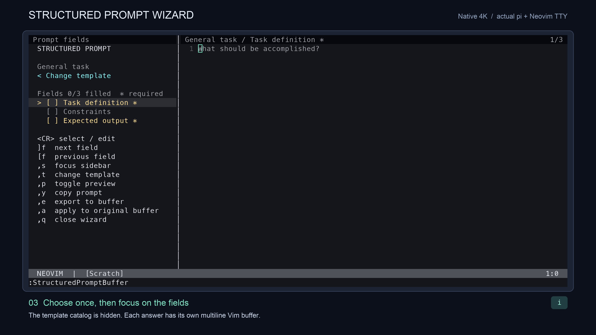
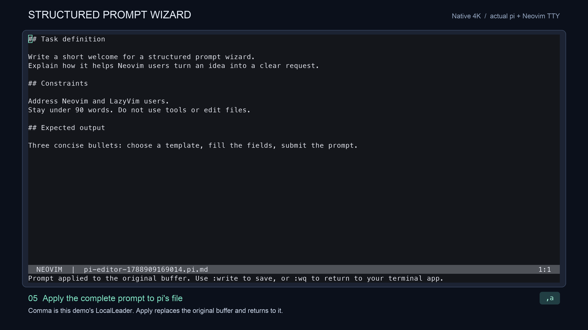
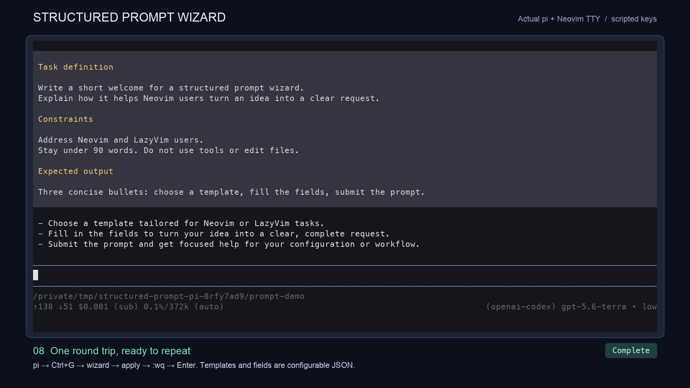

# pi → Neovim → structured prompt → pi

The new 1:24 demonstration records an actual pi terminal session and the Neovim
process launched by its external editor. Scripted keystrokes drive the real apps;
the captured terminal cells are rendered as a 1920×1080 H.264 video with captions.
The final response comes from an actual model submission in pi.

[Watch the 1:24 video on YouTube](https://youtu.be/JVMYZFYO_FA) (unlisted).
The generated local video is `structured-prompt-pi-demo.mp4` in this directory.
Video and frame caches are excluded from Git.

| Time | Action |
| --- | --- |
| 0:00 | Start in pi and press Ctrl+G |
| 0:08 | Run `:StructuredPromptBuffer` from pi's editor file |
| 0:15 | Choose a template; the catalog hides and its fields appear |
| 0:29 | Fill multiline answers and use Ctrl+G, Ctrl+N between fields |
| 0:51 | Apply the assembled prompt to the original file with `,a` |
| 0:58 | Save with `:wq` and review the text in pi |
| 1:09 | Press Enter and receive a real model response |





The [saved prompt](example-prompt.md) was checked against all three field values
after Neovim exited. The recorder also verifies that pi receives the text,
that selecting a template hides the catalog, and that a model response finishes.
The video was inspected at the key stages and decoded end to end with ffmpeg.

## Reproduce

Install `pi`, `tmux`, `nvim`, and `ffmpeg`, then install Python dependencies in a
virtual environment:

```sh
python3 -m venv /tmp/structured-prompt-video-venv
/tmp/structured-prompt-video-venv/bin/pip install -r tools/requirements-demo.txt
/tmp/structured-prompt-video-venv/bin/python tools/record_pi_demo.py
```

Run from the repository root. The renderer defaults to macOS Menlo and Arial;
on other platforms set `DEMO_MONO_FONT` and `DEMO_SANS_FONT` to font file paths.
Recording requires an existing pi login and **submits one brief to a model**.
The recorded run used pi 0.80.6, Neovim 0.12.2, and
`openai-codex/gpt-5.6-terra`. Set `DEMO_PROVIDER` and `DEMO_MODEL` to use another
authenticated model; wording and response time will vary.

The recorder creates a temporary pi configuration, temporary working directory,
and isolated tmux server. It shares pi's existing authentication file for normal
OAuth refresh, leaves editor settings alone, disables tools and resource
discovery, and does not save a pi session. Temporary files are removed on exit.
The plugin itself does not call a model or require pi.

The [earlier JSON catalog video](https://youtu.be/2tpgUYRdvzc) covers adding fields,
adding a release-notes template, and reloading the catalog while retaining drafts.
